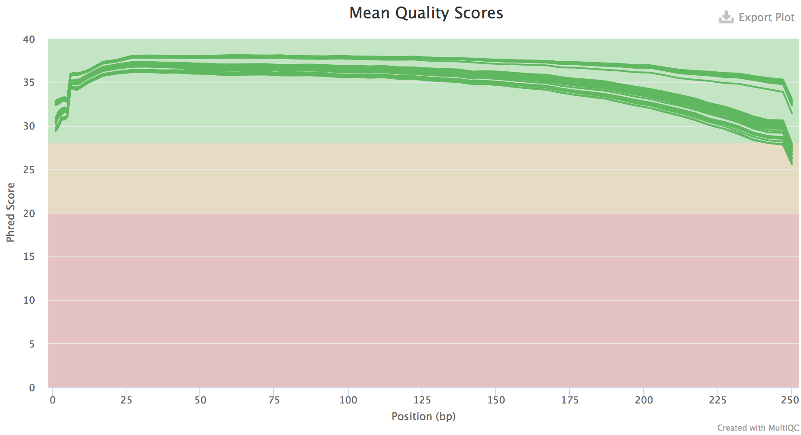
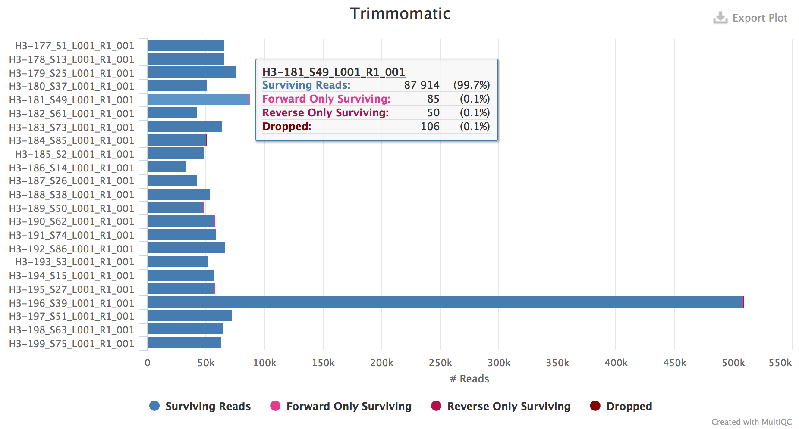
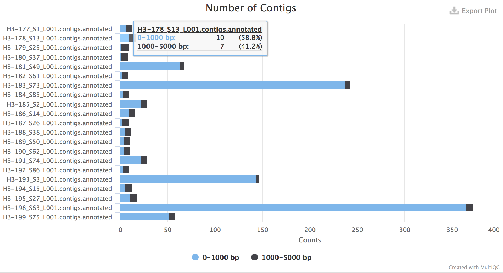

Process Overview
----------------

### FastQC

FastQC is used as a preliminary quality control metric for each of the FASTQ formatted sequence files. This step produces html reports for quality scores, sequence and adapter content, and length distributions.



### Trimmomatic

Trimmomatic is used to remove adapter sequences and other contaminants and low quality base pairs from the user input sequence data. These sequences can be truncated in the presence of adapter sequences or low quality sequence fragments. Sequences will also be removed if the trimming operations result in a read below a user-defined length. If either read (forward or reverse) is removed, both reads are removed from the forward and reverse file.



### SPAdes

SPAdes is used to assemble the cleaned FASTQ files from the previous trimming step. Output from this step is a FASTA formatted contigs file containing each of the eight influenza genome segments.



### Blastn

Blastn is used to annotate each of the genome segments (or contigs) within the assembly file. These annotations are produced using sequences from the Influenza Virus Database. This database includes over 500,000 individual sequences for influenza A, B, and C viruses.

```
>gi|662496343|gb|KJ942596|Influenza_A_virus_(A/Indiana/10/2011(H3N2))_segment_8_nuclear_export_protein_(NEP)_and_nonstructural_protein_1_(NS1)_genes,_complete_cds
CGCCAGCGAAAGCAGGGTGACAAAGACATAATGGACTCCAATACTGTGTCAAGTTTTCAG
GTAGACTGTTTCCTTTGGCACATCCGCAAACGGTTTGCAGACAATGGATTGGGTGATGCC
CCATTTCTTGATCGGCTCCGCCGAGATCAAAAGTCCCTAAAAGGAAGAGGCAACACCCTT
GGCCTTGATGTCGAAACTGCCACTCTTGTTGGGAAGCAAATTGTGGAGTGGATTTTGAGA
GAGGAGTCCAGCGAGACACTTAAGATGACCATTGCATCTGTACCTACTTCGCGCTACATA
GCTGACATGACCCTCGAGGAAATGTCACGAGACTGGTTCATGCTCATGCCTAGGCAAAAG
ATAATAGGCCCTCTTTGTGTGCGAATGGATCAGGCGATCATGGAAAAGAACATTATACTG
AAAGCGAACTTCAGTGTGATCTTTAACCGATTAGAGACTTTGATACTACTAAGGGCTTTC
ACTGAGGAGGGAGCAATCGTTGGAGAAATTTCACCATTACCTTCTCTTCCAGGACATAAT
AACGAGGATGTCAAAAATGCAGTTGGGGTCCTCATCGGAGGACTTGAATGGAATGATAAC
ACGGTTCGAGGCTCTGAAAATCTACAGAGATTCGCTTGGAGAAACCGTAATGAGGATGGG
AGACCTTCACTACCTCCAGAGCAGAAATGAAAAGTGGCGAGAGCAATTGGGACAGAAATT
TGAGGAAATAAGGTGGTTAGTTGAAGAAGTACGACACAGATTGAAGGCAACAGAAAATAG
TTTCGAACAAATAACATTTATGCAAGCCTTACAACTACTGCTTGAAGTAGAGCAAGAGAT
AAGGACTTTCTCGTTTCAGCTTATTTAATGATAAAAAACACCCTTGTTTCTACTGGCGC
```
